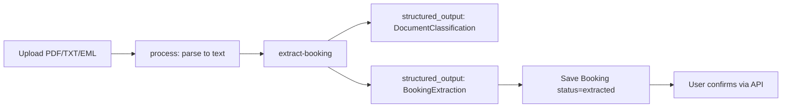
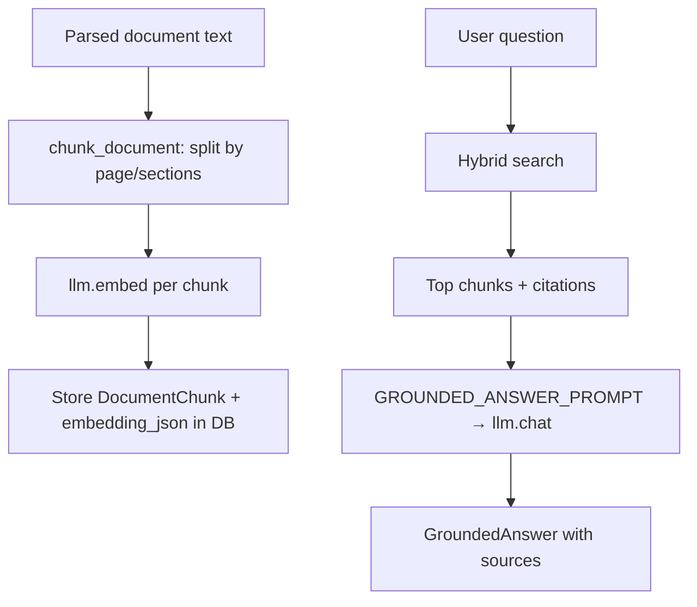
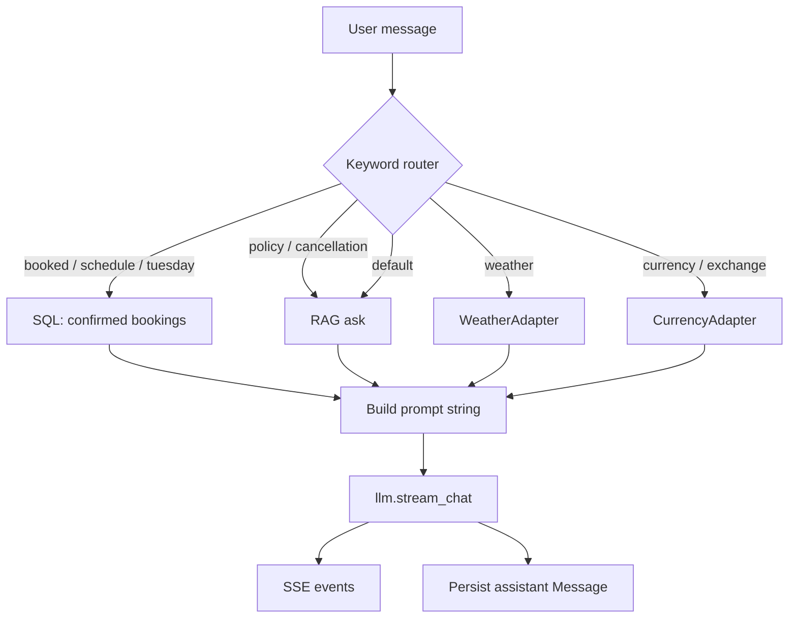

# AI Layer — How LLMs and RAG Work in Travel Planner API

This guide explains how the backend uses local LLMs (Ollama), mock fallbacks, prompts, and retrieval-augmented generation (RAG). It maps concepts to real files so you can follow the code.

## Big picture

All AI calls go through a single **`LLMProvider`** interface (`app/services/llm/provider.py`):

| Method | Purpose |
|--------|---------|
| `chat` | One-shot text completion |
| `stream_chat` | Token-by-token streaming |
| `structured_output` | JSON → Pydantic model (classification, extraction) |
| `embed` | Vector embeddings for RAG |

**Factory:** `get_llm_provider()` in `app/services/llm/ollama.py` returns either:

- **`MockLLMProvider`** when `USE_MOCK_LLM=true` (default dev setup — no Ollama required)
- **`OllamaProvider`** when `USE_MOCK_LLM=false` (real local LLM via HTTP)

`OllamaProvider` probes `GET /api/tags`; if Ollama is down it **falls back to mock** for every call. There is no LangChain or LlamaIndex — just `httpx` to Ollama’s `/api/chat` and `/api/embeddings`.

```python
# app/services/llm/ollama.py
def get_llm_provider() -> LLMProvider:
    if settings.use_mock_llm:
        return MockLLMProvider()
    return OllamaProvider()
```

### Services that use the LLM

| Service | File | LLM usage |
|---------|------|-----------|
| Documents | `app/services/documents.py` | Classification + extraction (`structured_output`) |
| Retrieval | `app/services/retrieval.py` | Embeddings + grounded answers (`embed`, `chat`) |
| Chat | `app/services/chat.py` | Streaming replies (`stream_chat`) |
| Eval | `app/api/v1/routes/eval.py` | Dev smoke test for structured output |

**Not using LLM today:** `PlannerService` (`app/services/planner.py`) — itinerary proposals are rule-based despite `PLANNER_PROMPT` existing for future use.

---

## Where prompts live

Prompts are plain Python string templates in `app/services/llm/prompts/document.py`:

| Template | Used by | Purpose |
|----------|---------|---------|
| `CLASSIFICATION_PROMPT` | `DocumentService.extract_booking` | Label document type (hotel, flight, etc.) |
| `EXTRACTION_PROMPT` | `DocumentService.extract_booking` | Pull booking fields from parsed text |
| `GROUNDED_ANSWER_PROMPT` | `RetrievalService.ask` | Answer only from retrieved chunks |
| `PLANNER_PROMPT` | *(unused)* | Reserved for future LLM itinerary generation |

Chat builds prompts **inline** in `app/services/chat.py` (bookings context, weather JSON, RAG results) rather than shared templates.

### Prompt safety

Document prompts label content as **“untrusted data”** and instruct the model not to follow instructions embedded in uploads. RAG prompts require answers **only from provided passages** and to say when information is missing.

---

## Flow 1: Document ingestion → extraction (structured LLM)

This is **not RAG** — the LLM reads parsed text directly.



### Steps

1. **`POST /v1/trips/{id}/documents`** — file saved to disk; no LLM.
2. **`POST /v1/documents/{id}/process`** — PyMuPDF / stdlib email parser extracts raw text (`app/services/ingestion/parser.py`).
3. **`POST /v1/documents/{id}/extract-booking`** — two LLM calls in `DocumentService`:

```python
classification = await self.llm.structured_output(
    [{"role": "user", "content": CLASSIFICATION_PROMPT.format(content=doc.extracted_text[:8000])}],
    DocumentClassification,
)
extraction = await self.llm.structured_output(
    [{"role": "user", "content": EXTRACTION_PROMPT.format(content=doc.extracted_text[:12000])}],
    BookingExtraction,
)
```

### How `structured_output` works (Ollama)

1. Send chat messages to Ollama.
2. Append a user message: *“Return ONLY valid JSON matching this schema: …”* (Pydantic `model_json_schema()`).
3. Parse JSON from the response and validate with Pydantic.
4. On parse failure → fall back to `MockLLMProvider`.

### Output schemas

Defined in `app/schemas/__init__.py`:

- **`DocumentClassification`** — `document_type`, `confidence`
- **`BookingExtraction`** — `type`, `title`, `confirmation_code`, `start_at`, `end_at`, `source_evidence`, `uncertainty_notes`, etc.

### Business rules (post-LLM, in Python)

- Duplicate detection by confirmation code or provider+title → `status=conflict`
- User must call **`POST /v1/bookings/{id}/confirm`** — the LLM never auto-confirms
- Date validation and overlap checks run in `app/services/trips.py` on confirm

---

## Flow 2: RAG (embed → retrieve → grounded answer)

RAG is a **separate pipeline**. You must call embed after parsing:

```
process → embed → search / ask-document-question / chat (doc paths)
```



### Indexing — `POST /v1/documents/{id}/embed`

`DocumentService.embed_document`:

1. Re-parse file for page metadata.
2. **`chunk_document`** — heuristic splits on page markers, `CHECK-IN`, `CANCELLATION`, `POLICY`, etc. (`app/services/ingestion/parser.py`). Not LLM-based.
3. **`llm.embed(texts)`** — one vector per chunk.
4. Store rows in `DocumentChunk` with `embedding_json` (SQLite dev path stores vectors as JSON; no pgvector required locally).

### Retrieval — `_hybrid_search`

For each chunk in the trip:

| Signal | Weight | How |
|--------|--------|-----|
| Keyword | 40% | Count query terms found in chunk text |
| Vector | 60% | Cosine similarity between query embedding and stored chunk embedding |

```python
query_embedding = (await self.llm.embed([query]))[0]
score = keyword_score * 0.4 + vector_score * 0.6
```

Top-N chunks are returned sorted by score.

### Answering — `POST /v1/trips/{id}/ask-document-question`

`RetrievalService.ask`:

1. Hybrid search (default top 5 chunks).
2. Build source passages with citations (`SourceCitation`: document title, page, excerpt).
3. Fill `GROUNDED_ANSWER_PROMPT` with question + sources.
4. **`llm.chat`** → natural language answer.
5. If answer contains “could not find” / “not found” → `found=false`, sources cleared.

### Search only — `POST /v1/trips/{id}/search`

Returns ranked chunks and scores **without** calling the LLM.

### Response shape

```json
{
  "question": "...",
  "answer": "...",
  "found": true,
  "sources": [
    {
      "type": "document",
      "title": "hotel_confirmation.pdf",
      "page": 2,
      "excerpt": "...",
      "source_id": "..."
    }
  ]
}
```

---

## Flow 3: Chat (orchestrator + SSE streaming)

Chat is **not** a free-form agent with LLM tool-calling. Python routes the question, gathers context, then streams an LLM reply.



### Endpoint

**`POST /v1/trips/{id}/chat/stream`** — Server-Sent Events (`app/api/v1/routes/chat.py`).

### SSE event types

| Event | When |
|-------|------|
| `status` | Progress (“Searching trip documents”, etc.) |
| `sources` | Citations from bookings or documents |
| `token` | Streamed text chunk |
| `tool_result` | Weather or currency adapter result |
| `error` | Failure |
| `done` | `message_id`, `sources`, usage |

### Routing logic (`ChatService.stream_answer`)

| Trigger keywords | Data source | LLM input |
|------------------|-------------|-----------|
| booked, booking, reservation, schedule, weekday names | Confirmed bookings from DB | Booking list + question |
| policy, cancellation, check-in, luggage | `RetrievalService.ask` | RAG answer or sources + question |
| weather | Open-Meteo via `WeatherAdapter` | Weather JSON + question |
| exchange, currency | open.er-api via `CurrencyAdapter` | Rate JSON + question |
| *(default)* | `RetrievalService.ask` | RAG result |

**Note:** Policy/doc paths may invoke RAG (`llm.chat` inside `ask`) and then stream again via `stream_chat` — potentially two LLM calls on some questions.

### Persistence

Assistant messages are saved to `Message` with `sources_json` for later retrieval via conversation endpoints.

---

## Flow 4: Itinerary planner (not LLM today)

`PlannerService.generate_proposal`:

- Builds day skeletons from **confirmed bookings** and travel preferences
- Applies **rainy-day** swaps using `WeatherAdapter`
- Validates overlaps and locked items in Python

`PLANNER_PROMPT` in `document.py` is reserved for a future LLM-driven planner.

---

## Mock vs real Ollama

| Concern | Mock (`USE_MOCK_LLM=true`) | Ollama (`USE_MOCK_LLM=false`) |
|---------|---------------------------|-------------------------------|
| Classification | Always `hotel_reservation` | Parsed from document |
| Extraction | Fixed mock hotel (Aug 5–8 2026) | JSON from document text |
| Embeddings | Deterministic hash-based 384-dim vectors | Configured model (e.g. `nomic-embed-text`) |
| Chat / RAG answers | Generic `"Based on your trip data: …"` | Real model output |
| Structured output | Hardcoded Pydantic instances | JSON + schema validation |

### Relevant env vars (`.env`)

```env
USE_MOCK_LLM=true          # false when Ollama is running
OLLAMA_BASE_URL=http://localhost:11434
OLLAMA_CHAT_MODEL=llama3.2
OLLAMA_EMBEDDING_MODEL=nomic-embed-text
```

---

## End-to-end document lifecycle

```
Upload
  → process (parse text, no LLM)
  → extract-booking (LLM ×2: classify + extract)
  → confirm booking (no LLM — user + validation rules)
  → embed (LLM embed ×N chunks)   ← required for RAG
  → search / ask-document-question / chat can use document context
```

If you **skip `embed`**, extraction still works, but document search and Q&A return empty results.

---

## Design principles

1. **Single abstraction** — swap mock/Ollama without changing feature services.
2. **Grounding** — RAG and chat attach `SourceCitation` for traceability.
3. **No agent framework** — external tools are invoked by Python routing, not LLM tool selection.
4. **Business rules in code** — dates, overlaps, confirm/reject stay in services; the LLM proposes or explains, it does not commit state.
5. **Local-first** — Ollama on your machine; no paid API keys in v1.

---

## Code map (quick reference)

```
app/services/llm/
  provider.py          # LLMProvider protocol
  ollama.py            # MockLLMProvider, OllamaProvider, get_llm_provider()
  prompts/document.py  # Prompt templates

app/services/documents.py   # upload, process, extract, embed
app/services/retrieval.py   # hybrid search, ask, search
app/services/chat.py        # SSE chat orchestration
app/services/ingestion/parser.py  # parse PDF/TXT/EML, chunk, cosine_similarity

app/api/v1/routes/
  documents.py   # document + embed endpoints
  retrieval.py   # search, ask-document-question
  chat.py        # chat/stream SSE
  eval.py        # dev eval smoke test
```

---

## Try it yourself

1. Start API with mock LLM (default): `python -m uvicorn app.main:app --reload --host 0.0.0.0 --port 8000`
2. Open http://localhost:8000/docs
3. Create a trip → upload a `.txt` reservation → `process` → `extract-booking` → `embed`
4. Call `ask-document-question` or `chat/stream` and watch `sources` in the response
5. Set `USE_MOCK_LLM=false`, start Ollama with chat + embedding models, repeat and compare outputs
